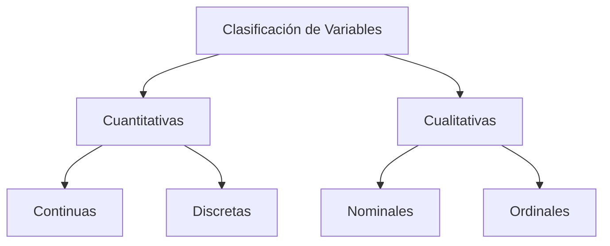

# Variables y su clasificación

## Definicón de Variables 

Una **variable** es una característica, cualidad o propiedad que se observa en los individuos u objetos que pertenecen a una **población o muestra**.

Una variable puede tomar diferentes valores entre los elementos estudiados. Los **datos** corresponden a los valores que observamos y registramos para una variable.

Por ejemplo, si estudiamos los servidores de una organización, **el tiempo de respuesta** puede ser una variable y los valores `120 ms`, `150 ms` y `98 ms` son datos observados de esa variable.

Las variables pueden clasificarse inicialmente en **cuantitativas** y **cualitativas**, dependiendo de la naturaleza de los valores que pueden tomar.

### Variables cuantitativas

Son aquellas variables cuyos valores pueden **expresarse mediante números** y representan cantidades que pueden medirse o contarse.

Ejemplos:

* **Tamaño de archivos transmitidos:** expresado en MB o GB.
* **Número de usuarios activos:** expresado mediante un conteo.
* **Costo mensual de infraestructura en la nube:** expresado en USD.
* **Tiempo de respuesta de una aplicación:** expresado en milisegundos (ms).
* **Porcentaje de uso del CPU:** expresado en porcentaje (%).

### Variables cualitativas

Son aquellas variables cuyos valores representan **categorías o cualidades** de los elementos estudiados. Generalmente se expresan mediante palabras o etiquetas en lugar de cantidades numéricas.

Ejemplos:

* **Rol del usuario:** administrador, desarrollador o usuario final.
* **Sistema operativo:** Windows, Linux o macOS.
* **Tipo de amenaza de seguridad:** phishing, malware o ransomware.

Aunque estas categorías puedan almacenarse internamente mediante números en un programa, esos números funcionan como **códigos o etiquetas** y no necesariamente representan cantidades.

### Idea clave

**Variable = característica que estudiamos.**
**Dato = valor que observamos para esa variable.**

Por ejemplo:

**Variable:** tiempo de respuesta
**Datos:** 120 ms, 150 ms, 98 ms, 175 ms...

La diferencia principal es:

**Cuantitativa → representa una cantidad.**

**Cualitativa → representa una categoría o cualidad.**

De esta forma, las variables se pueden clasificar, según el tipo de dato, de la siguiente manera:

