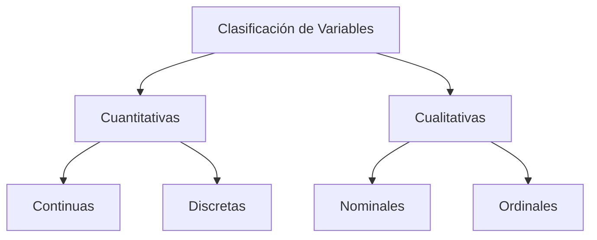

# ¿Cómo se clasifican las variables?

De esta forma, las variables se pueden clasificar, según el tipo de dato, de la siguiente manera:

---

Las variables pueden clasificarse según la naturaleza de sus valores en **cuantitativas** y **cualitativas**.

## Variables cuantitativas

Son variables cuyos valores representan **cantidades numéricas**. Se dividen en **discretas** y **continuas**, dependiendo de cómo se obtienen sus valores.

### Variables continuas

Son variables que pueden tomar **cualquier valor real dentro de un intervalo determinado**. Generalmente, sus valores se obtienen mediante un **proceso de medición**.

Por ejemplo:

* **Latencia de red:** medida en milisegundos (ms).
* **Tiempo de respuesta de un sistema:** medido en milisegundos (ms).
* **Uso de memoria:** medido en GB.
* **Ancho de banda utilizado:** medido en Mbps.

Una variable continua puede asumir valores decimales. Por ejemplo, un tiempo de respuesta podría ser **125 ms, 125,4 ms o 125,43 ms**, dependiendo de la precisión de la medición.

### Variables discretas

Son variables que pueden tomar **valores numéricos específicos y separados**, generalmente obtenidos mediante un **proceso de conteo**.

Por ejemplo:

* **Número de usuarios conectados:** 10, 11, 12, 13...
* **Número de errores registrados:** 0, 1, 2, 3...
* **Número de transacciones procesadas por minuto:** 100, 101, 102...

En este caso, los valores representan cantidades que se pueden **contar** y, por lo general, no tiene sentido que entre dos valores enteros exista otro valor de la misma variable.

## Variables cualitativas

Son variables cuyos valores representan **categorías, características o cualidades** de los elementos estudiados.

Se dividen en **nominales** y **ordinales**, dependiendo de si existe o no un orden entre sus categorías.

### Variables nominales

Son variables cuyas categorías **no tienen un orden o jerarquía natural**. Sirven para clasificar los elementos de acuerdo con una característica.

Por ejemplo:

* **Sistema operativo:** Windows, Linux, macOS.
* **Lenguaje de programación:** Java, Python, JavaScript, C#.
* **Tipo de base de datos:** SQL, NoSQL.

No existe una categoría que sea “mayor” o “menor” que otra. Por ejemplo, no tiene sentido afirmar que Linux es mayor que Windows.

### Variables ordinales

Son variables cuyas categorías **pueden organizarse siguiendo un orden o jerarquía**. Sin embargo, el orden no significa necesariamente que exista una distancia numérica conocida o uniforme entre las categorías.

Por ejemplo:

* **Nivel de severidad de una incidencia:** leve → moderado → crítico.
* **Prioridad de un ticket:** necesario → urgente → emergencia.
* **Nivel de acceso de un usuario:** básico → avanzado → administrador.

Existe un **orden**, pero no podemos asumir que la diferencia entre una categoría y otra sea numéricamente equivalente.

## Resumen de la clasificación

| Tipo de variable          | ¿Qué representa?                                           | ¿Cómo se obtiene?        | Ejemplo             |
| ------------------------- | ---------------------------------------------------------- | ------------------------ | ------------------- |
| **Cuantitativa continua** | Cantidades que pueden tomar valores dentro de un intervalo | Medición                 | Tiempo de respuesta |
| **Cuantitativa discreta** | Cantidades que pueden contarse                             | Conteo                   | Número de usuarios  |
| **Cualitativa nominal**   | Categorías sin orden                                       | Clasificación            | Sistema operativo   |
| **Cualitativa ordinal**   | Categorías con orden                                       | Clasificación jerárquica | Nivel de severidad  |

### Regla práctica para identificar una variable

Puedes hacerte dos preguntas:

**1. ¿El valor representa una cantidad numérica?**

* Sí → **Cuantitativa**
* No → **Cualitativa**

**2. Si es cuantitativa, se obtiene principalmente midiendo o contando?**

* Midiendo → **Continua**
* Contando → **Discreta**

**Si es cualitativa, existe un orden natural entre las categorías?**

* No → **Nominal**
* Sí → **Ordinal**
